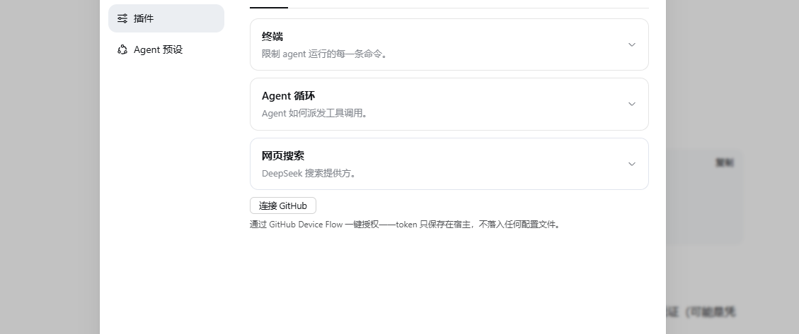

# dsh-github-connector

[简体中文](README.md) | **English**

A GitHub connector plugin for [DeepSeek Harness (dsh)](https://github.com/deepseek-ai/deepseek-harness) — connect your GitHub account in one click, then create, review, and merge pull requests without leaving the dsh conversation.

- **One-click connect** — GitHub Device Flow from dsh settings; no token copy-pasting.
- **PR bar above the composer** — create PR / AI review / merge, triggered by git state.
- **Model-side tools** — `github_search`, `github_issue_read`, `github_pr_read`, `github_issue_create`, `github_issue_comment`, `github_pr_create`.

When your branch is ahead of the default branch, a PR bar appears above the composer for one-click PR creation:


Docs (中文): [documentation index](docs/README.md) · [architecture](docs/design/design.md) · [ADRs](docs/adr/README.md)

## Installation

Prerequisites: Node ≥ 22.19, pnpm, and the dsh CLI (`npm install -g @deepseek-ai/dsh`).

Install from npm — one command:

```bash
dsh plugin --profile web add dsh-github dsh-github-rest dsh-tool-github dsh-github-connect dsh-ui-github
```

(Substitute your profile name — `headless`, `tui`, … — for `web`. `dsh-ui-github` renders in the web client only; skip it on non-web profiles.)

## Connect your GitHub account

Open **dsh Settings → Plugins** and click **Connect GitHub**, then follow the Device Flow prompts — the token stays in the host process and never touches a config file:



For CLI / headless use, set the `GITHUB_TOKEN` environment variable (a personal access token with `repo` scope) instead.

## License

[MIT](LICENSE)
